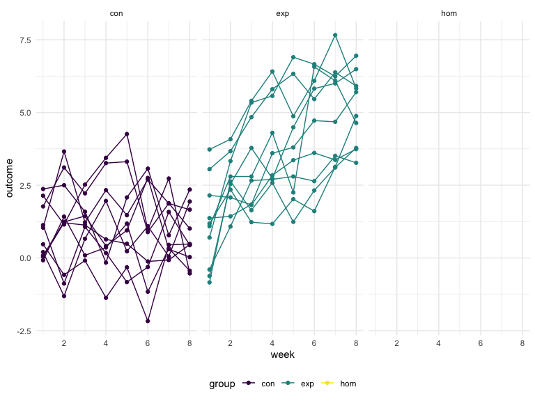
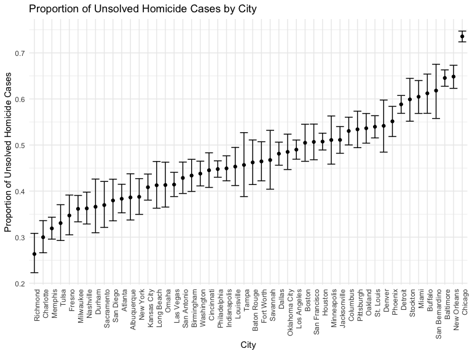

Homework 5
================
Hongji Jiang
2022-11-16

### Problem 0

This “problem” focuses on structure of your submission, especially the
use git and GitHub for reproducibility, R Projects to organize your
work, R Markdown to write reproducible reports, relative paths to load
data from local files, and reasonable naming structures for your files.
This was not prepared as a GitHub repo.

``` r
library(tidyverse)
```

## Problem 1

The code chunk below imports the data in individual spreadsheets
contained in `./data/zip_data/`. To do this, I create a dataframe that
includes the list of all files in that directory and the complete path
to each file. As a next step, I `map` over paths and import data using
the `read_csv` function. Finally, I `unnest` the result of `map`.

``` r
full_df = 
  tibble(
    files = list.files("./data/"),
    path = str_c("./data/", files)
  ) %>% 
  mutate(data = map(path, read_csv)) %>% 
  unnest(cols = c(data))
```

    ## Rows: 1 Columns: 8
    ## ── Column specification ────────────────────────────────────────────────────────
    ## Delimiter: ","
    ## dbl (8): week_1, week_2, week_3, week_4, week_5, week_6, week_7, week_8
    ## 
    ## ℹ Use `spec()` to retrieve the full column specification for this data.
    ## ℹ Specify the column types or set `show_col_types = FALSE` to quiet this message.
    ## Rows: 1 Columns: 8
    ## ── Column specification ────────────────────────────────────────────────────────
    ## Delimiter: ","
    ## dbl (8): week_1, week_2, week_3, week_4, week_5, week_6, week_7, week_8
    ## 
    ## ℹ Use `spec()` to retrieve the full column specification for this data.
    ## ℹ Specify the column types or set `show_col_types = FALSE` to quiet this message.
    ## Rows: 1 Columns: 8
    ## ── Column specification ────────────────────────────────────────────────────────
    ## Delimiter: ","
    ## dbl (8): week_1, week_2, week_3, week_4, week_5, week_6, week_7, week_8
    ## 
    ## ℹ Use `spec()` to retrieve the full column specification for this data.
    ## ℹ Specify the column types or set `show_col_types = FALSE` to quiet this message.
    ## Rows: 1 Columns: 8
    ## ── Column specification ────────────────────────────────────────────────────────
    ## Delimiter: ","
    ## dbl (8): week_1, week_2, week_3, week_4, week_5, week_6, week_7, week_8
    ## 
    ## ℹ Use `spec()` to retrieve the full column specification for this data.
    ## ℹ Specify the column types or set `show_col_types = FALSE` to quiet this message.
    ## Rows: 1 Columns: 8
    ## ── Column specification ────────────────────────────────────────────────────────
    ## Delimiter: ","
    ## dbl (8): week_1, week_2, week_3, week_4, week_5, week_6, week_7, week_8
    ## 
    ## ℹ Use `spec()` to retrieve the full column specification for this data.
    ## ℹ Specify the column types or set `show_col_types = FALSE` to quiet this message.
    ## Rows: 1 Columns: 8
    ## ── Column specification ────────────────────────────────────────────────────────
    ## Delimiter: ","
    ## dbl (8): week_1, week_2, week_3, week_4, week_5, week_6, week_7, week_8
    ## 
    ## ℹ Use `spec()` to retrieve the full column specification for this data.
    ## ℹ Specify the column types or set `show_col_types = FALSE` to quiet this message.
    ## Rows: 1 Columns: 8
    ## ── Column specification ────────────────────────────────────────────────────────
    ## Delimiter: ","
    ## dbl (8): week_1, week_2, week_3, week_4, week_5, week_6, week_7, week_8
    ## 
    ## ℹ Use `spec()` to retrieve the full column specification for this data.
    ## ℹ Specify the column types or set `show_col_types = FALSE` to quiet this message.
    ## Rows: 1 Columns: 8
    ## ── Column specification ────────────────────────────────────────────────────────
    ## Delimiter: ","
    ## dbl (8): week_1, week_2, week_3, week_4, week_5, week_6, week_7, week_8
    ## 
    ## ℹ Use `spec()` to retrieve the full column specification for this data.
    ## ℹ Specify the column types or set `show_col_types = FALSE` to quiet this message.
    ## Rows: 1 Columns: 8
    ## ── Column specification ────────────────────────────────────────────────────────
    ## Delimiter: ","
    ## dbl (8): week_1, week_2, week_3, week_4, week_5, week_6, week_7, week_8
    ## 
    ## ℹ Use `spec()` to retrieve the full column specification for this data.
    ## ℹ Specify the column types or set `show_col_types = FALSE` to quiet this message.
    ## Rows: 1 Columns: 8
    ## ── Column specification ────────────────────────────────────────────────────────
    ## Delimiter: ","
    ## dbl (8): week_1, week_2, week_3, week_4, week_5, week_6, week_7, week_8
    ## 
    ## ℹ Use `spec()` to retrieve the full column specification for this data.
    ## ℹ Specify the column types or set `show_col_types = FALSE` to quiet this message.
    ## Rows: 1 Columns: 8
    ## ── Column specification ────────────────────────────────────────────────────────
    ## Delimiter: ","
    ## dbl (8): week_1, week_2, week_3, week_4, week_5, week_6, week_7, week_8
    ## 
    ## ℹ Use `spec()` to retrieve the full column specification for this data.
    ## ℹ Specify the column types or set `show_col_types = FALSE` to quiet this message.
    ## Rows: 1 Columns: 8
    ## ── Column specification ────────────────────────────────────────────────────────
    ## Delimiter: ","
    ## dbl (8): week_1, week_2, week_3, week_4, week_5, week_6, week_7, week_8
    ## 
    ## ℹ Use `spec()` to retrieve the full column specification for this data.
    ## ℹ Specify the column types or set `show_col_types = FALSE` to quiet this message.
    ## Rows: 1 Columns: 8
    ## ── Column specification ────────────────────────────────────────────────────────
    ## Delimiter: ","
    ## dbl (8): week_1, week_2, week_3, week_4, week_5, week_6, week_7, week_8
    ## 
    ## ℹ Use `spec()` to retrieve the full column specification for this data.
    ## ℹ Specify the column types or set `show_col_types = FALSE` to quiet this message.
    ## Rows: 1 Columns: 8
    ## ── Column specification ────────────────────────────────────────────────────────
    ## Delimiter: ","
    ## dbl (8): week_1, week_2, week_3, week_4, week_5, week_6, week_7, week_8
    ## 
    ## ℹ Use `spec()` to retrieve the full column specification for this data.
    ## ℹ Specify the column types or set `show_col_types = FALSE` to quiet this message.
    ## Rows: 1 Columns: 8
    ## ── Column specification ────────────────────────────────────────────────────────
    ## Delimiter: ","
    ## dbl (8): week_1, week_2, week_3, week_4, week_5, week_6, week_7, week_8
    ## 
    ## ℹ Use `spec()` to retrieve the full column specification for this data.
    ## ℹ Specify the column types or set `show_col_types = FALSE` to quiet this message.
    ## Rows: 1 Columns: 8
    ## ── Column specification ────────────────────────────────────────────────────────
    ## Delimiter: ","
    ## dbl (8): week_1, week_2, week_3, week_4, week_5, week_6, week_7, week_8
    ## 
    ## ℹ Use `spec()` to retrieve the full column specification for this data.
    ## ℹ Specify the column types or set `show_col_types = FALSE` to quiet this message.
    ## Rows: 1 Columns: 8
    ## ── Column specification ────────────────────────────────────────────────────────
    ## Delimiter: ","
    ## dbl (8): week_1, week_2, week_3, week_4, week_5, week_6, week_7, week_8
    ## 
    ## ℹ Use `spec()` to retrieve the full column specification for this data.
    ## ℹ Specify the column types or set `show_col_types = FALSE` to quiet this message.
    ## Rows: 1 Columns: 8
    ## ── Column specification ────────────────────────────────────────────────────────
    ## Delimiter: ","
    ## dbl (8): week_1, week_2, week_3, week_4, week_5, week_6, week_7, week_8
    ## 
    ## ℹ Use `spec()` to retrieve the full column specification for this data.
    ## ℹ Specify the column types or set `show_col_types = FALSE` to quiet this message.
    ## Rows: 1 Columns: 8
    ## ── Column specification ────────────────────────────────────────────────────────
    ## Delimiter: ","
    ## dbl (8): week_1, week_2, week_3, week_4, week_5, week_6, week_7, week_8
    ## 
    ## ℹ Use `spec()` to retrieve the full column specification for this data.
    ## ℹ Specify the column types or set `show_col_types = FALSE` to quiet this message.
    ## Rows: 1 Columns: 8
    ## ── Column specification ────────────────────────────────────────────────────────
    ## Delimiter: ","
    ## dbl (8): week_1, week_2, week_3, week_4, week_5, week_6, week_7, week_8
    ## 
    ## ℹ Use `spec()` to retrieve the full column specification for this data.
    ## ℹ Specify the column types or set `show_col_types = FALSE` to quiet this message.
    ## Rows: 52179 Columns: 12
    ## ── Column specification ────────────────────────────────────────────────────────
    ## Delimiter: ","
    ## chr (9): uid, victim_last, victim_first, victim_race, victim_age, victim_sex...
    ## dbl (3): reported_date, lat, lon
    ## 
    ## ℹ Use `spec()` to retrieve the full column specification for this data.
    ## ℹ Specify the column types or set `show_col_types = FALSE` to quiet this message.

``` r
full_df
```

    ## # A tibble: 52,199 × 22
    ##    files     path  week_1 week_2 week_3 week_4 week_5 week_6 week_7 week_8 uid  
    ##    <chr>     <chr>  <dbl>  <dbl>  <dbl>  <dbl>  <dbl>  <dbl>  <dbl>  <dbl> <chr>
    ##  1 con_01.c… ./da…   0.2   -1.31   0.66   1.96   0.23   1.09   0.05   1.94 <NA> 
    ##  2 con_02.c… ./da…   1.13  -0.88   1.07   0.17  -0.83  -0.31   1.58   0.44 <NA> 
    ##  3 con_03.c… ./da…   1.77   3.11   2.22   3.26   3.31   0.89   1.88   1.01 <NA> 
    ##  4 con_04.c… ./da…   1.04   3.66   1.22   2.33   1.47   2.7    1.87   1.66 <NA> 
    ##  5 con_05.c… ./da…   0.47  -0.58  -0.09  -1.37  -0.32  -2.17   0.45   0.48 <NA> 
    ##  6 con_06.c… ./da…   2.37   2.5    1.59  -0.16   2.08   3.07   0.78   2.35 <NA> 
    ##  7 con_07.c… ./da…   0.03   1.21   1.13   0.64   0.49  -0.12  -0.07   0.46 <NA> 
    ##  8 con_08.c… ./da…  -0.08   1.42   0.09   0.36   1.18  -1.16   0.33  -0.44 <NA> 
    ##  9 con_09.c… ./da…   0.08   1.24   1.44   0.41   0.95   2.75   0.3    0.03 <NA> 
    ## 10 con_10.c… ./da…   2.14   1.15   2.52   3.44   4.26   0.97   2.73  -0.53 <NA> 
    ## # … with 52,189 more rows, and 11 more variables: reported_date <dbl>,
    ## #   victim_last <chr>, victim_first <chr>, victim_race <chr>, victim_age <chr>,
    ## #   victim_sex <chr>, city <chr>, state <chr>, lat <dbl>, lon <dbl>,
    ## #   disposition <chr>

The result of the previous code chunk isn’t tidy – data are wide rather
than long, and some important variables are included as parts of others.
The code chunk below tides the data using string manipulations on the
file, converting from wide to long, and selecting relevant variables.

``` r
tidy_df = 
  full_df %>% 
  mutate(
    files = str_replace(files, ".csv", ""),
    group = str_sub(files, 1, 3)) %>% 
  pivot_longer(
    week_1:week_8,
    names_to = "week",
    values_to = "outcome",
    names_prefix = "week_") %>% 
  mutate(week = as.numeric(week)) %>% 
  select(group, subj = files, week, outcome)
tidy_df
```

    ## # A tibble: 417,592 × 4
    ##    group subj    week outcome
    ##    <chr> <chr>  <dbl>   <dbl>
    ##  1 con   con_01     1    0.2 
    ##  2 con   con_01     2   -1.31
    ##  3 con   con_01     3    0.66
    ##  4 con   con_01     4    1.96
    ##  5 con   con_01     5    0.23
    ##  6 con   con_01     6    1.09
    ##  7 con   con_01     7    0.05
    ##  8 con   con_01     8    1.94
    ##  9 con   con_02     1    1.13
    ## 10 con   con_02     2   -0.88
    ## # … with 417,582 more rows

Finally, the code chunk below creates a plot showing individual data,
faceted by group.

``` r
tidy_df %>% 
  ggplot(aes(x = week, y = outcome, group = subj, color = group)) + 
  geom_point() + 
  geom_path() + 
  facet_grid(~group)
```



This plot suggests high within-subject correlation – subjects who start
above average end up above average, and those that start below average
end up below average. Subjects in the control group generally don’t
change over time, but those in the experiment group increase their
outcome in a roughly linear way.

\##Problem 2

``` r
homicide_data = read_csv("./data/homicide-data.csv")
```

    ## Rows: 52179 Columns: 12
    ## ── Column specification ────────────────────────────────────────────────────────
    ## Delimiter: ","
    ## chr (9): uid, victim_last, victim_first, victim_race, victim_age, victim_sex...
    ## dbl (3): reported_date, lat, lon
    ## 
    ## ℹ Use `spec()` to retrieve the full column specification for this data.
    ## ℹ Specify the column types or set `show_col_types = FALSE` to quiet this message.

This dataset has 52179 rows and 12 columns. The columns(variables) are
uid, reported_date, victim_last, victim_first, victim_race, victim_age,
victim_sex, city, state, lat, lon, disposition and each row is a
homicide incidnet.

``` r
homicide_data=
  homicide_data %>%
  mutate(city_state = str_c(city, state, sep = ", "))
```

Created a new variable city_state by concatenating city and state,
seperateing with ‘,’.

``` r
cities=
  homicide_data %>%
  mutate(
    unsolved = case_when(
      disposition == "Open/No arrest" ~ 1,
      disposition == "Closed without arrest" ~ 1,
      disposition == "Closed by arrest" ~ 0,
    )
  ) %>%
  group_by(city) %>%
  summarize(
    num_case = n(),
    num_unsolved_case = sum(unsolved)
  )
```

Summarize within cities to obtain the total number of homicides and the
number of unsolved homicides

``` r
cities %>% 
  filter(city == "Baltimore")
```

    ## # A tibble: 1 × 3
    ##   city      num_case num_unsolved_case
    ##   <chr>        <int>             <dbl>
    ## 1 Baltimore     2827              1825

``` r
proportion_baltimore <-prop.test(
  cities%>%
    filter(city == "Baltimore") %>% 
    pull(num_unsolved_case), 
  cities%>%
    filter(city == "Baltimore") %>% 
    pull(num_case))%>%
  broom::tidy()
proportion_baltimore
```

    ## # A tibble: 1 × 8
    ##   estimate statistic  p.value parameter conf.low conf.high method        alter…¹
    ##      <dbl>     <dbl>    <dbl>     <int>    <dbl>     <dbl> <chr>         <chr>  
    ## 1    0.646      239. 6.46e-54         1    0.628     0.663 1-sample pro… two.si…
    ## # … with abbreviated variable name ¹​alternative

``` r
all_cities = 
  cities %>%
  mutate(
    all_cities_proportion = map2(.x = num_unsolved_case, .y = num_case, ~prop.test(x = .x, n = .y)),
    all_cities_proportion = map(all_cities_proportion, broom::tidy)) %>% 
  unnest(cols = c(all_cities_proportion)) %>%
  select(city, num_unsolved_case, num_case, estimate, conf.low, conf.high)
all_cities
```

    ## # A tibble: 50 × 6
    ##    city        num_unsolved_case num_case estimate conf.low conf.high
    ##    <chr>                   <dbl>    <int>    <dbl>    <dbl>     <dbl>
    ##  1 Albuquerque               146      378    0.386    0.337     0.438
    ##  2 Atlanta                   373      973    0.383    0.353     0.415
    ##  3 Baltimore                1825     2827    0.646    0.628     0.663
    ##  4 Baton Rouge               196      424    0.462    0.414     0.511
    ##  5 Birmingham                347      800    0.434    0.399     0.469
    ##  6 Boston                    310      614    0.505    0.465     0.545
    ##  7 Buffalo                   319      521    0.612    0.569     0.654
    ##  8 Charlotte                 206      687    0.300    0.266     0.336
    ##  9 Chicago                  4073     5535    0.736    0.724     0.747
    ## 10 Cincinnati                309      694    0.445    0.408     0.483
    ## # … with 40 more rows

``` r
all_cities%>%
  mutate(city = fct_reorder(city, estimate)) %>%
  ggplot(aes(x = city, y = estimate)) +
  geom_point() +
  geom_errorbar(aes(ymin = conf.low, ymax = conf.high)) +
  labs(y = "Estimated proportion", x = "City", title = "Proportion of Unsolved Homicide Cases") +
  theme(axis.text.x = element_text(angle = 90, hjust = 1)
  ) 
```



\##Problem 3
