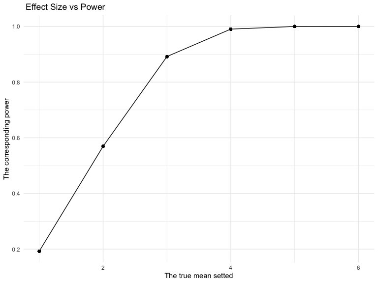
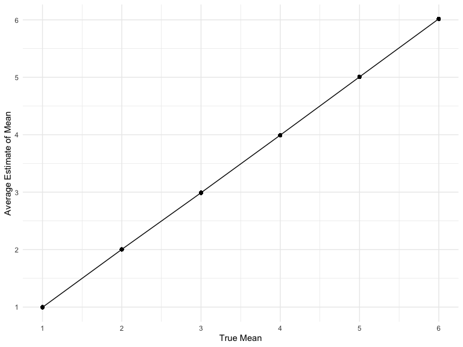
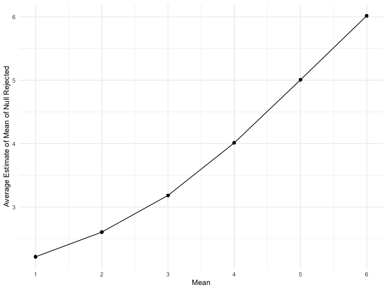

Homework 5
================
Hongji Jiang
2022-11-17

### Problem 0

This “problem” focuses on structure of your submission, especially the
use git and GitHub for reproducibility, R Projects to organize your
work, R Markdown to write reproducible reports, relative paths to load
data from local files, and reasonable naming structures for your files.
This was not prepared as a GitHub repo.

``` r
library(tidyverse)
```

## Problem 1

The code chunk below imports the data in individual spreadsheets
contained in `./data/zip_data/`. To do this, I create a dataframe that
includes the list of all files in that directory and the complete path
to each file. As a next step, I `map` over paths and import data using
the `read_csv` function. Finally, I `unnest` the result of `map`.

``` r
full_df = 
  tibble(
    files = list.files("./data/"),
    path = str_c("./data/", files)
  ) %>% 
  mutate(data = map(path, read_csv)) %>% 
  unnest(cols = c(data))
```

    ## Rows: 1 Columns: 8
    ## ── Column specification ────────────────────────────────────────────────────────
    ## Delimiter: ","
    ## dbl (8): week_1, week_2, week_3, week_4, week_5, week_6, week_7, week_8
    ## 
    ## ℹ Use `spec()` to retrieve the full column specification for this data.
    ## ℹ Specify the column types or set `show_col_types = FALSE` to quiet this message.
    ## Rows: 1 Columns: 8
    ## ── Column specification ────────────────────────────────────────────────────────
    ## Delimiter: ","
    ## dbl (8): week_1, week_2, week_3, week_4, week_5, week_6, week_7, week_8
    ## 
    ## ℹ Use `spec()` to retrieve the full column specification for this data.
    ## ℹ Specify the column types or set `show_col_types = FALSE` to quiet this message.
    ## Rows: 1 Columns: 8
    ## ── Column specification ────────────────────────────────────────────────────────
    ## Delimiter: ","
    ## dbl (8): week_1, week_2, week_3, week_4, week_5, week_6, week_7, week_8
    ## 
    ## ℹ Use `spec()` to retrieve the full column specification for this data.
    ## ℹ Specify the column types or set `show_col_types = FALSE` to quiet this message.
    ## Rows: 1 Columns: 8
    ## ── Column specification ────────────────────────────────────────────────────────
    ## Delimiter: ","
    ## dbl (8): week_1, week_2, week_3, week_4, week_5, week_6, week_7, week_8
    ## 
    ## ℹ Use `spec()` to retrieve the full column specification for this data.
    ## ℹ Specify the column types or set `show_col_types = FALSE` to quiet this message.
    ## Rows: 1 Columns: 8
    ## ── Column specification ────────────────────────────────────────────────────────
    ## Delimiter: ","
    ## dbl (8): week_1, week_2, week_3, week_4, week_5, week_6, week_7, week_8
    ## 
    ## ℹ Use `spec()` to retrieve the full column specification for this data.
    ## ℹ Specify the column types or set `show_col_types = FALSE` to quiet this message.
    ## Rows: 1 Columns: 8
    ## ── Column specification ────────────────────────────────────────────────────────
    ## Delimiter: ","
    ## dbl (8): week_1, week_2, week_3, week_4, week_5, week_6, week_7, week_8
    ## 
    ## ℹ Use `spec()` to retrieve the full column specification for this data.
    ## ℹ Specify the column types or set `show_col_types = FALSE` to quiet this message.
    ## Rows: 1 Columns: 8
    ## ── Column specification ────────────────────────────────────────────────────────
    ## Delimiter: ","
    ## dbl (8): week_1, week_2, week_3, week_4, week_5, week_6, week_7, week_8
    ## 
    ## ℹ Use `spec()` to retrieve the full column specification for this data.
    ## ℹ Specify the column types or set `show_col_types = FALSE` to quiet this message.
    ## Rows: 1 Columns: 8
    ## ── Column specification ────────────────────────────────────────────────────────
    ## Delimiter: ","
    ## dbl (8): week_1, week_2, week_3, week_4, week_5, week_6, week_7, week_8
    ## 
    ## ℹ Use `spec()` to retrieve the full column specification for this data.
    ## ℹ Specify the column types or set `show_col_types = FALSE` to quiet this message.
    ## Rows: 1 Columns: 8
    ## ── Column specification ────────────────────────────────────────────────────────
    ## Delimiter: ","
    ## dbl (8): week_1, week_2, week_3, week_4, week_5, week_6, week_7, week_8
    ## 
    ## ℹ Use `spec()` to retrieve the full column specification for this data.
    ## ℹ Specify the column types or set `show_col_types = FALSE` to quiet this message.
    ## Rows: 1 Columns: 8
    ## ── Column specification ────────────────────────────────────────────────────────
    ## Delimiter: ","
    ## dbl (8): week_1, week_2, week_3, week_4, week_5, week_6, week_7, week_8
    ## 
    ## ℹ Use `spec()` to retrieve the full column specification for this data.
    ## ℹ Specify the column types or set `show_col_types = FALSE` to quiet this message.
    ## Rows: 1 Columns: 8
    ## ── Column specification ────────────────────────────────────────────────────────
    ## Delimiter: ","
    ## dbl (8): week_1, week_2, week_3, week_4, week_5, week_6, week_7, week_8
    ## 
    ## ℹ Use `spec()` to retrieve the full column specification for this data.
    ## ℹ Specify the column types or set `show_col_types = FALSE` to quiet this message.
    ## Rows: 1 Columns: 8
    ## ── Column specification ────────────────────────────────────────────────────────
    ## Delimiter: ","
    ## dbl (8): week_1, week_2, week_3, week_4, week_5, week_6, week_7, week_8
    ## 
    ## ℹ Use `spec()` to retrieve the full column specification for this data.
    ## ℹ Specify the column types or set `show_col_types = FALSE` to quiet this message.
    ## Rows: 1 Columns: 8
    ## ── Column specification ────────────────────────────────────────────────────────
    ## Delimiter: ","
    ## dbl (8): week_1, week_2, week_3, week_4, week_5, week_6, week_7, week_8
    ## 
    ## ℹ Use `spec()` to retrieve the full column specification for this data.
    ## ℹ Specify the column types or set `show_col_types = FALSE` to quiet this message.
    ## Rows: 1 Columns: 8
    ## ── Column specification ────────────────────────────────────────────────────────
    ## Delimiter: ","
    ## dbl (8): week_1, week_2, week_3, week_4, week_5, week_6, week_7, week_8
    ## 
    ## ℹ Use `spec()` to retrieve the full column specification for this data.
    ## ℹ Specify the column types or set `show_col_types = FALSE` to quiet this message.
    ## Rows: 1 Columns: 8
    ## ── Column specification ────────────────────────────────────────────────────────
    ## Delimiter: ","
    ## dbl (8): week_1, week_2, week_3, week_4, week_5, week_6, week_7, week_8
    ## 
    ## ℹ Use `spec()` to retrieve the full column specification for this data.
    ## ℹ Specify the column types or set `show_col_types = FALSE` to quiet this message.
    ## Rows: 1 Columns: 8
    ## ── Column specification ────────────────────────────────────────────────────────
    ## Delimiter: ","
    ## dbl (8): week_1, week_2, week_3, week_4, week_5, week_6, week_7, week_8
    ## 
    ## ℹ Use `spec()` to retrieve the full column specification for this data.
    ## ℹ Specify the column types or set `show_col_types = FALSE` to quiet this message.
    ## Rows: 1 Columns: 8
    ## ── Column specification ────────────────────────────────────────────────────────
    ## Delimiter: ","
    ## dbl (8): week_1, week_2, week_3, week_4, week_5, week_6, week_7, week_8
    ## 
    ## ℹ Use `spec()` to retrieve the full column specification for this data.
    ## ℹ Specify the column types or set `show_col_types = FALSE` to quiet this message.
    ## Rows: 1 Columns: 8
    ## ── Column specification ────────────────────────────────────────────────────────
    ## Delimiter: ","
    ## dbl (8): week_1, week_2, week_3, week_4, week_5, week_6, week_7, week_8
    ## 
    ## ℹ Use `spec()` to retrieve the full column specification for this data.
    ## ℹ Specify the column types or set `show_col_types = FALSE` to quiet this message.
    ## Rows: 1 Columns: 8
    ## ── Column specification ────────────────────────────────────────────────────────
    ## Delimiter: ","
    ## dbl (8): week_1, week_2, week_3, week_4, week_5, week_6, week_7, week_8
    ## 
    ## ℹ Use `spec()` to retrieve the full column specification for this data.
    ## ℹ Specify the column types or set `show_col_types = FALSE` to quiet this message.
    ## Rows: 1 Columns: 8
    ## ── Column specification ────────────────────────────────────────────────────────
    ## Delimiter: ","
    ## dbl (8): week_1, week_2, week_3, week_4, week_5, week_6, week_7, week_8
    ## 
    ## ℹ Use `spec()` to retrieve the full column specification for this data.
    ## ℹ Specify the column types or set `show_col_types = FALSE` to quiet this message.
    ## Rows: 52179 Columns: 12
    ## ── Column specification ────────────────────────────────────────────────────────
    ## Delimiter: ","
    ## chr (9): uid, victim_last, victim_first, victim_race, victim_age, victim_sex...
    ## dbl (3): reported_date, lat, lon
    ## 
    ## ℹ Use `spec()` to retrieve the full column specification for this data.
    ## ℹ Specify the column types or set `show_col_types = FALSE` to quiet this message.

``` r
full_df
```

    ## # A tibble: 52,199 × 22
    ##    files     path  week_1 week_2 week_3 week_4 week_5 week_6 week_7 week_8 uid  
    ##    <chr>     <chr>  <dbl>  <dbl>  <dbl>  <dbl>  <dbl>  <dbl>  <dbl>  <dbl> <chr>
    ##  1 con_01.c… ./da…   0.2   -1.31   0.66   1.96   0.23   1.09   0.05   1.94 <NA> 
    ##  2 con_02.c… ./da…   1.13  -0.88   1.07   0.17  -0.83  -0.31   1.58   0.44 <NA> 
    ##  3 con_03.c… ./da…   1.77   3.11   2.22   3.26   3.31   0.89   1.88   1.01 <NA> 
    ##  4 con_04.c… ./da…   1.04   3.66   1.22   2.33   1.47   2.7    1.87   1.66 <NA> 
    ##  5 con_05.c… ./da…   0.47  -0.58  -0.09  -1.37  -0.32  -2.17   0.45   0.48 <NA> 
    ##  6 con_06.c… ./da…   2.37   2.5    1.59  -0.16   2.08   3.07   0.78   2.35 <NA> 
    ##  7 con_07.c… ./da…   0.03   1.21   1.13   0.64   0.49  -0.12  -0.07   0.46 <NA> 
    ##  8 con_08.c… ./da…  -0.08   1.42   0.09   0.36   1.18  -1.16   0.33  -0.44 <NA> 
    ##  9 con_09.c… ./da…   0.08   1.24   1.44   0.41   0.95   2.75   0.3    0.03 <NA> 
    ## 10 con_10.c… ./da…   2.14   1.15   2.52   3.44   4.26   0.97   2.73  -0.53 <NA> 
    ## # … with 52,189 more rows, and 11 more variables: reported_date <dbl>,
    ## #   victim_last <chr>, victim_first <chr>, victim_race <chr>, victim_age <chr>,
    ## #   victim_sex <chr>, city <chr>, state <chr>, lat <dbl>, lon <dbl>,
    ## #   disposition <chr>

The result of the previous code chunk isn’t tidy – data are wide rather
than long, and some important variables are included as parts of others.
The code chunk below tides the data using string manipulations on the
file, converting from wide to long, and selecting relevant variables.

``` r
tidy_df = 
  full_df %>% 
  mutate(
    files = str_replace(files, ".csv", ""),
    group = str_sub(files, 1, 3)) %>% 
  pivot_longer(
    week_1:week_8,
    names_to = "week",
    values_to = "outcome",
    names_prefix = "week_") %>% 
  mutate(week = as.numeric(week)) %>% 
  select(group, subj = files, week, outcome)
tidy_df
```

    ## # A tibble: 417,592 × 4
    ##    group subj    week outcome
    ##    <chr> <chr>  <dbl>   <dbl>
    ##  1 con   con_01     1    0.2 
    ##  2 con   con_01     2   -1.31
    ##  3 con   con_01     3    0.66
    ##  4 con   con_01     4    1.96
    ##  5 con   con_01     5    0.23
    ##  6 con   con_01     6    1.09
    ##  7 con   con_01     7    0.05
    ##  8 con   con_01     8    1.94
    ##  9 con   con_02     1    1.13
    ## 10 con   con_02     2   -0.88
    ## # … with 417,582 more rows

Finally, the code chunk below creates a plot showing individual data,
faceted by group.

``` r
tidy_df %>% 
  ggplot(aes(x = week, y = outcome, group = subj, color = group)) + 
  geom_point() + 
  geom_path() + 
  facet_grid(~group)
```


This plot suggests high within-subject correlation – subjects who start
above average end up above average, and those that start below average
end up below average. Subjects in the control group generally don’t
change over time, but those in the experiment group increase their
outcome in a roughly linear way.

\##Problem 2

``` r
homicide_data = read_csv("./data/homicide-data.csv")
```

    ## Rows: 52179 Columns: 12
    ## ── Column specification ────────────────────────────────────────────────────────
    ## Delimiter: ","
    ## chr (9): uid, victim_last, victim_first, victim_race, victim_age, victim_sex...
    ## dbl (3): reported_date, lat, lon
    ## 
    ## ℹ Use `spec()` to retrieve the full column specification for this data.
    ## ℹ Specify the column types or set `show_col_types = FALSE` to quiet this message.

This dataset has 52179 rows and 12 columns. The columns(variables) are
uid, reported_date, victim_last, victim_first, victim_race, victim_age,
victim_sex, city, state, lat, lon, disposition and each row is a
homicide incidnet.

``` r
homicide_data=
  homicide_data %>%
  mutate(city_state = str_c(city, state, sep = ", "))
```

Created a new variable `city_state` by concatenating city and state,
seperateing with ‘,’.

``` r
cities=
  homicide_data %>%
  mutate(
    unsolved = case_when(
      disposition == "Open/No arrest" ~ 1,
      disposition == "Closed without arrest" ~ 1,
      disposition == "Closed by arrest" ~ 0,
    )
  ) %>%
  group_by(city) %>%
  summarize(
    num_case = n(),
    num_unsolved_case = sum(unsolved)
  )
```

Summarize within cities to obtain the total number of homicides and the
number of unsolved homicides

``` r
cities %>% 
  filter(city == "Baltimore")
```

    ## # A tibble: 1 × 3
    ##   city      num_case num_unsolved_case
    ##   <chr>        <int>             <dbl>
    ## 1 Baltimore     2827              1825

Filter data only with the city Baltimore

``` r
proportion_baltimore <-prop.test(
  cities%>%
    filter(city == "Baltimore") %>% 
    pull(num_unsolved_case), 
  cities%>%
    filter(city == "Baltimore") %>% 
    pull(num_case))%>%
  broom::tidy()
proportion_baltimore %>% 
  select(estimate, conf.low, conf.high) %>% 
  knitr::kable(digits = 3)
```

| estimate | conf.low | conf.high |
|---------:|---------:|----------:|
|    0.646 |    0.628 |     0.663 |

The code chunk above used `prop.test` function and `broom::tidy` to get
the estimated proportion of homicides that are unsolved among all the
hoicide cases in Baltimore, MD. The estimate proportion is 0.646. And
the condience interval is (0.628, 0.663).

``` r
all_cities = 
  cities %>%
  mutate(
    all_cities_proportion = map2(.x = num_unsolved_case, .y = num_case, ~prop.test(x = .x, n = .y)),
    all_cities_proportion = map(all_cities_proportion, broom::tidy)) %>% 
  unnest(cols = c(all_cities_proportion)) %>%
  select(city, num_unsolved_case, num_case, estimate, conf.low, conf.high)
all_cities %>% 
  select(estimate, conf.low, conf.high) %>% 
  knitr::kable(digits = 3)
```

| estimate | conf.low | conf.high |
|---------:|---------:|----------:|
|    0.386 |    0.337 |     0.438 |
|    0.383 |    0.353 |     0.415 |
|    0.646 |    0.628 |     0.663 |
|    0.462 |    0.414 |     0.511 |
|    0.434 |    0.399 |     0.469 |
|    0.505 |    0.465 |     0.545 |
|    0.612 |    0.569 |     0.654 |
|    0.300 |    0.266 |     0.336 |
|    0.736 |    0.724 |     0.747 |
|    0.445 |    0.408 |     0.483 |
|    0.530 |    0.500 |     0.560 |
|    0.481 |    0.456 |     0.506 |
|    0.542 |    0.485 |     0.598 |
|    0.588 |    0.569 |     0.608 |
|    0.366 |    0.310 |     0.426 |
|    0.464 |    0.422 |     0.507 |
|    0.347 |    0.305 |     0.391 |
|    0.507 |    0.489 |     0.526 |
|    0.449 |    0.422 |     0.477 |
|    0.511 |    0.482 |     0.540 |
|    0.408 |    0.380 |     0.437 |
|    0.414 |    0.388 |     0.441 |
|    0.413 |    0.363 |     0.464 |
|    0.490 |    0.469 |     0.511 |
|    0.453 |    0.412 |     0.495 |
|    0.319 |    0.296 |     0.343 |
|    0.605 |    0.569 |     0.640 |
|    0.361 |    0.333 |     0.391 |
|    0.511 |    0.459 |     0.563 |
|    0.362 |    0.329 |     0.398 |
|    0.649 |    0.623 |     0.673 |
|    0.388 |    0.349 |     0.427 |
|    0.536 |    0.504 |     0.569 |
|    0.485 |    0.447 |     0.524 |
|    0.413 |    0.365 |     0.463 |
|    0.448 |    0.430 |     0.466 |
|    0.551 |    0.518 |     0.584 |
|    0.534 |    0.494 |     0.573 |
|    0.263 |    0.223 |     0.308 |
|    0.370 |    0.321 |     0.421 |
|    0.429 |    0.395 |     0.463 |
|    0.618 |    0.558 |     0.675 |
|    0.380 |    0.335 |     0.426 |
|    0.507 |    0.468 |     0.545 |
|    0.467 |    0.404 |     0.532 |
|    0.540 |    0.515 |     0.564 |
|    0.599 |    0.552 |     0.645 |
|    0.457 |    0.388 |     0.527 |
|    0.330 |    0.293 |     0.371 |
|    0.438 |    0.411 |     0.465 |

The code chunk above used `prop.test` function, `map2`, `map` and
`broom::tidy` to get the estimated proportion of unresolved homicides in
all cities.

``` r
all_cities%>%
  mutate(city = fct_reorder(city, estimate)) %>%
  ggplot(aes(x = city, y = estimate)) +
  geom_point() +
  geom_errorbar(aes(ymin = conf.low, ymax = conf.high)) +
  labs(y = "Proportion of Unsolved Homicide Cases", x = "City", title = "Proportion of Unsolved Homicide Cases by City") +
  theme(axis.text.x = element_text(angle = 90, hjust = 1)
  ) 
```


Create a plot that shows the estimated proportion of unresolved homocide
and CIs for each city and add the errorbars based on the lower and upper
limits.

\##Problem 3

``` r
test_simulation = function(mean_input) {
  vector = rnorm(30, mean = mean_input, sd = 5)
  
  t.test(vector) %>% 
    broom::tidy() %>% 
    select(estimate, pvalue = p.value)
}
```

Create a function that generate dataset from the normal distribution
model given and obtain the estimate and p-value.

``` r
result1 = 
  expand_grid(
    set_mean = 0,
    iteration = 1:5000
    
  ) %>% 
  mutate(
    testresult = map(set_mean, test_simulation)
  ) %>% 
  unnest(testresult)
```

Generate 5000 datasets from the model.

``` r
result2 = 
  expand_grid(
    set_mean = 1:6,
    iteration = 1:5000
    
  ) %>% 
  mutate(
    testresult = map(set_mean, test_simulation)
  ) %>% 
  unnest(testresult)
```

Repeat the above for μ={1,2,3,4,5,6}

``` r
data_for_plot = 
  result2 %>% 
  group_by(set_mean) %>% 
  mutate(
    null_rejected = ifelse(pvalue < 0.05, 1, 0),
    power = mean(null_rejected)
  ) 
data_for_plot %>% 
  ggplot(aes(x = set_mean, y = power)) +
  geom_point() +
  geom_line() +
  labs(
    title = " Effect Size vs Power",
    x = "The true mean setted",
    y = "The corresponding power"
  )
```



``` r
avg_est = data_for_plot %>% 
  group_by(set_mean) %>%
  mutate(mean_estimate = mean(estimate)) %>% 
  ggplot(aes(x = set_mean, y = mean_estimate)) +
  geom_point() +
  geom_line() +
  scale_x_continuous( breaks = 1:6 ) +
  scale_y_continuous( breaks = 1:6 ) +
  labs(
    x = "True Mean",
    y = "Average Estimate of Mean"
  ) 
avg_est
```



``` r
reject_null = data_for_plot %>% 
  filter(null_rejected == 1) %>%
  group_by(set_mean) %>%
  mutate(mean_estimate = mean(estimate)) %>% 
  ggplot(aes(x = set_mean, y = mean_estimate)) +
  geom_point() +
  geom_line() +
  scale_x_continuous( breaks = 1:6 ) +
  scale_y_continuous( breaks = 1:6 ) +
  labs(
    x = "Mean",
    y = "Average Estimate of Mean of Null Rejected"
  ) 

reject_null
```


In the first graph, we can see the average estimate of mu on the y axis
and the true value of mu on the x axis are very close to each other. In
the second graph, we can observe that in the samples where the null is
rejected, when the mu is equal to or smaller than 3, the sample average
of mu is obviously larger than the true value of mu. When mu is equal to
or larger than 4, it is not obviously different from the true value of
mu. We know that the power is relatively lower when mu is less than 3.
And this is why the sample average is higher than the true mu value when
the mu we set is less than or equal to 3. When the power is lower, the
estimate on the mu is less precise.
